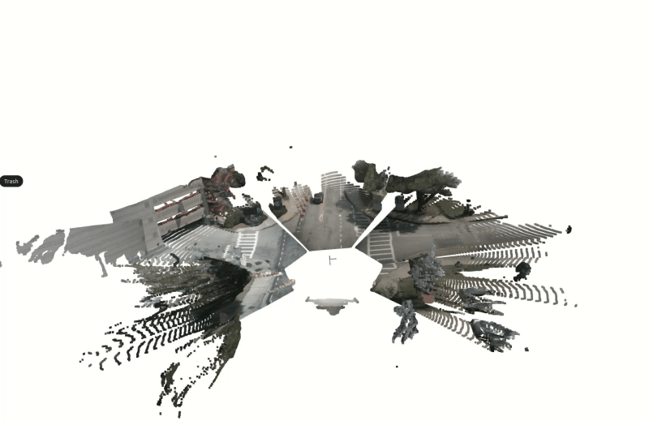
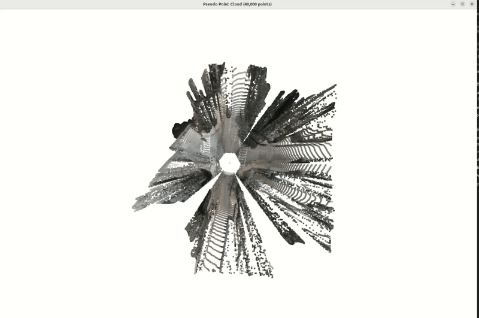
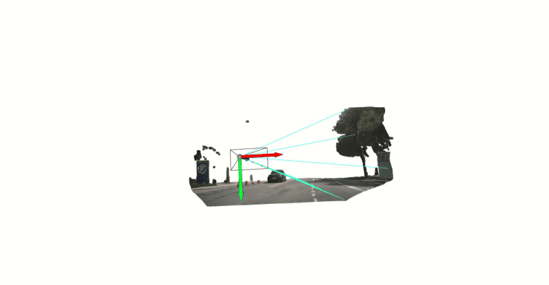
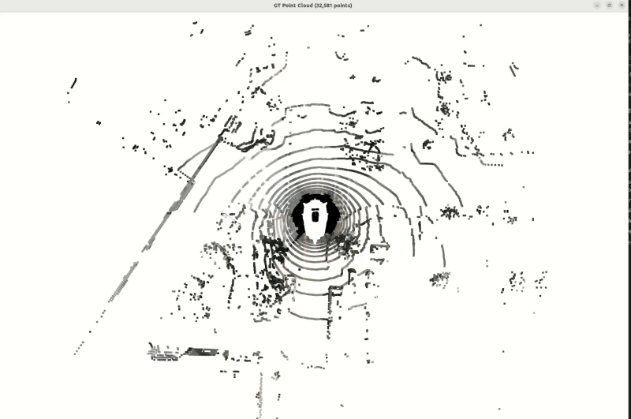
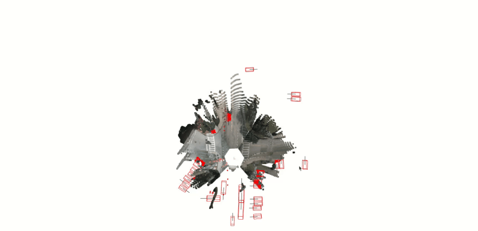
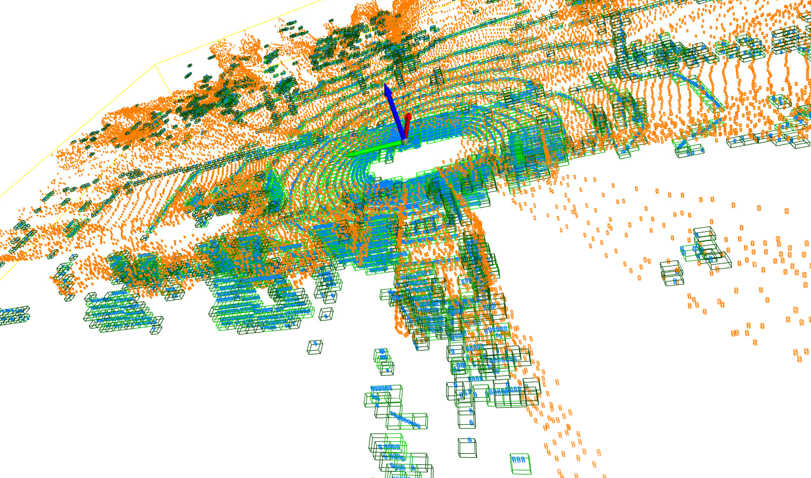
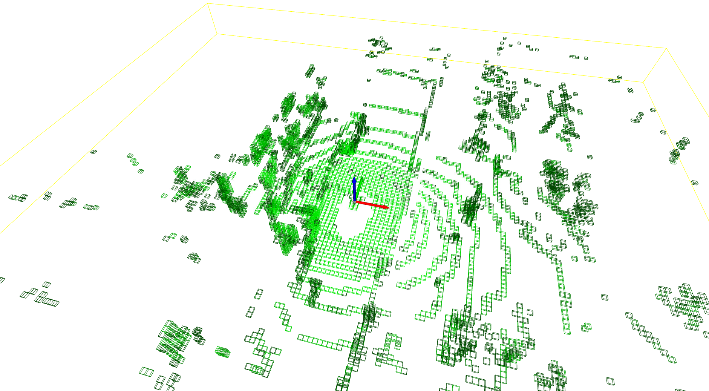

# 📦 3D Reconstruction Detection - ResDet3D

**ResDet3D** is a 3D object detection system that uses multi-view images to generate pseudo point clouds via Depth Anything 3 (DA3), then applies teacher-student feature alignment for domain adaptation.

## 🏗️ System Architecture

### Overview

The system follows a **two-stage approach**:

1. **3D Reconstruction Stage**: Generate pseudo point clouds from multi-view images using frozen Depth Anything 3
2. **Domain Adaptation Stage**: Align pseudo point cloud features with LiDAR features using teacher-student learning

### Stage 1: 3D Reconstruction (ReconstructionBackbone)

**Input**: Multi-view images (6 cameras)

**Process**:
```
Multi-view Images 
  → Frozen Depth Anything 3 (DA3)
    ├─ DinoV2 Backbone (Transformer) → Feature extraction
    └─ DualDPT Head (Convolutional) → Depth + Ray maps
  → Depth maps + Camera poses
  → Back-projection to 3D point clouds
  → Post-processing (Filter, BallQuery, FPS)
  → Pseudo point clouds
```

**Key Components**:
- **DA3 Model**: Frozen pre-trained model (`depth-anything/DA3NESTED-GIANT-LARGE`)
  - Generates depth maps and camera poses (via ray-based pose estimation)
  - Outputs: depth, depth_conf, ray maps (6 channels), extrinsics, intrinsics
- **Post-processing Pipeline**:
  - Range filtering
  - Ball query downsampling (density-aware)
  - FPS downsampling (uniform sampling to 40K points)

**Visualization Videos** (converted to GIF for GitHub display):

**Dense Scene Reconstruction** - Full 3D scene reconstruction from multi-view images  


**Pseudo Point Cloud Downsampling** - Post-processing pipeline demonstration  


**Front View Ray Visualization** - Camera ray visualization for pose estimation  


**GLB Export Visualization** - 3D point cloud exported to GLB format  


**LiDAR Input Reference** - Ground truth LiDAR point cloud for comparison  


**Whole Frame with Bounding Boxes** - Detection results with 3D bounding boxes  


> 💡 **Note**: To convert videos to GIF, run: `python tools/convert_videos_to_gif.py`

<!-- For offline/local viewing, uncomment the HTML video tags below:
<video width="800" controls>
  <source src="assets/dense_scene.mp4" type="video/mp4">
</video>
<video width="800" controls>
  <source src="assets/downsampling_pseudo_point.mp4" type="video/mp4">
</video>
<video width="800" controls>
  <source src="assets/front_view_ray_vis.mp4" type="video/mp4">
</video>
<video width="800" controls>
  <source src="assets/glb_vis.mp4" type="video/mp4">
</video>
<video width="800" controls>
  <source src="assets/Lidar_input.mp4" type="video/mp4">
</video>
<video width="800" controls>
  <source src="assets/whole_frame_with_bbox.mp4" type="video/mp4">
</video>
-->

### Stage 2: Domain Adaptation (SparseRefinement)

**Architecture Evolution**:

The system has successfully implemented and tested several approaches for domain adaptation before settling on the current pipeline:

1. **VoxelOccupancyEncoder Approaches** (✅ Successfully Implemented):
   - **HardVoxelOccupancyVFE**: Binary occupancy encoding for voxel structure alignment
   - **SoftVoxelOccupancyVFE**: Probabilistic occupancy encoding with learnable thresholds
   - **Purpose**: Directly align voxel occupancy patterns between pseudo and GT point clouds
   - **Key Insight**: Matching which voxels are occupied is crucial for sparsity pattern alignment
   - **Implementation**: Dice loss for occupancy mask alignment, ensuring same sparsity structure

2. **ShapeFormer-Inspired Autoregression Mode** (✅ Successfully Implemented):
   - **SparsePatternAdaptationFormer**: Transformer-based autoregressive point cloud reconstruction
   - **Architecture**:
     - Vector Quantization (VQ): Quantize sparse features to codebook indices
     - Coordinate Transformer: Autoregressively predict next voxel coordinate
     - Value Transformer: Predict codebook index for that coordinate
   - **Training**: Teacher forcing with sequence [S_P, END, S_C, END]
   - **Inference**: Autoregressive generation from pseudo points (S_P) only
   - **Key Features**:
     - Block-causal attention with sliding window (efficient O(T) generation)
     - KV cache for incremental generation
     - Adaptive sequence length based on GT reference
   - **Purpose**: Learn to reconstruct GT-like point cloud patterns from pseudo points using sequence modeling

3. **Current Approach**: Simple 2D BEV feature alignment first, then 3D detection
   - Focuses on feature-level alignment before complex pattern reconstruction
   - Simpler and more stable training dynamics

**Previous Approaches (Successfully Implemented)**:

```
Approach 1: Voxel Occupancy Alignment
┌─────────────────────────────────────────────────────────────┐
│ Pseudo Points ──► Voxelization ──► VoxelOccupancyEncoder    │
│                                                              │
│ GT Points ──► Voxelization ──► VoxelOccupancyEncoder         │
│                                                              │
│                    ▼ Dice Loss ▼                            │
│              Occupancy Mask Alignment                        │
└─────────────────────────────────────────────────────────────┘
```

**Visualization**: The input of Voxel occupancy pattern alignment between pseudo and GT point clouds


```
Approach 2: ShapeFormer-Inspired Autoregression
┌─────────────────────────────────────────────────────────────┐
│ Pseudo Points ──► Voxelization ──► VQ Codebook              │
│                                                              │
│                    ▼ Autoregressive Generation ▼            │
│                                                              │
│  Coordinate Transformer ──► Next Voxel Coord                │
│         │                                                    │
│         └─► Value Transformer ──► Feature Code               │
│                                                              │
│                    ▼ Sequence Loss ▼                        │
│              Reconstructed GT-like Pattern                  │
└─────────────────────────────────────────────────────────────┘
```

**Target Pattern**: The target of this submodule should return the pattern similar to LiDAR voxel structure


---

### Motivation for Current Approach

The previous approaches (Voxel Occupancy Alignment and ShapeFormer-inspired Autoregression) successfully demonstrated different strategies for domain adaptation. However, to quickly validate whether Depth Anything 3 can generate high-quality pseudo point clouds that serve as effective input for 3D detection models, we adopted a simpler teacher-student framework.

**Core Insight**: If pseudo point clouds and real LiDAR point clouds can produce the same 2D BEV (Bird's Eye View) features for the 3D detection head, then DA3 has successfully completed its mission. The key is feature-level alignment rather than exact point-level matching.

**Teacher-Student Strategy**:
- **Teacher (LiDAR)**: LiDAR point cloud → 2D BEV feature map
- **Student (Pseudo)**: Pseudo point cloud → 2D BEV feature map
- **Objective**: Align student's BEV features with teacher's BEV features

This approach focuses on the end goal (detection-ready features) rather than intermediate pattern reconstruction, making it simpler to train and validate.

**Current Pipeline**:
```
Pseudo Points ──► Voxelization ──► SparseEncoderV2 ──► Sparse Features
                                                          │
                                                          ├─► Dense BEV Features
                                                          │
GT Points (LiDAR) ──► Voxelization ──► SparseEncoderV2 ──► Sparse Features
                                                          │
                                                          └─► Dense BEV Features
                                                              │
                                                              ▼
                                                    Feature Alignment Loss
                                                              │
                                                              ▼
                                    SECOND Backbone ──► CenterHead ──► 3D BBoxes
```

**Teacher-Student Framework**:
- **Teacher Branch**: Uses LiDAR ground-truth points directly
  - Voxelization → SparseEncoderV2 → Dense BEV features
  - Provides supervision signal for feature alignment
- **Student Branch**: Uses pseudo point clouds from DA3
  - Same architecture as teacher (separate parameters)
  - Learns to match teacher's features via alignment losses

**Loss Functions** (Current Approach):
1. **SparseFeatureAlignmentLoss** (Primary):
   - Aligns sparse voxel features at overlapping voxels
   - Cosine similarity loss with feature normalization
   - Hard mining (top 50% hardest voxels)
   
2. **VoxelOccupancyAlignmentLoss** (Structure):
   - Dice loss for occupancy mask alignment
   - Ensures same sparsity pattern between pseudo and GT
   - **Note**: This loss was originally developed for the VoxelOccupancyEncoder approach

3. **DenseBEVFeatureLoss** (Auxiliary):
   - Aligns dense BEV features [B, C*D, H, W]
   - Foreground masking to avoid background dominance
   - Weak auxiliary loss (weight: 0.1)

**Previous Loss Functions** (From Earlier Approaches):
- **Occupancy Dice Loss**: Used in VoxelOccupancyEncoder for binary/probabilistic occupancy matching
- **Sequence Reconstruction Loss**: Used in SparsePatternAdaptationFormer for autoregressive coordinate-value prediction

**Detection Pipeline**:
- Pseudo branch features → **SECOND backbone** → **SECONDFPN neck** → **CenterHead**
- 3D bbox supervision on pseudo branch
- Shared detection head between teacher and student

### Key Design Choices

1. **DA3 is frozen**: No gradient updates to preserve pre-trained depth estimation quality
2. **Separate backbones**: Teacher and student have independent SparseEncoderV2 parameters
3. **Shared detection head**: Both branches use the same SECOND + CenterHead
4. **Feature alignment first**: Test simple 2D BEV alignment before complex 3D adaptation
5. **Multi-scale supervision**: Occupancy (structure) + Features (semantics) + BEV (dense)

---

# 📦 Installation Guide

This guide will walk you through setting up the Depth Anything 3 environment step by step.

## Prerequisites

- **Anaconda** or **Miniconda** installed on your system
- **CUDA-capable GPU** (recommended, but CPU-only is also supported)
- **Linux** or **Windows** (this guide focuses on Linux)

## Step 1: Check Your System

### Check CUDA availability (optional but recommended)
```bash
nvidia-smi
```
If this command works, you have CUDA support. Note your CUDA version (e.g., 12.1, 11.8).

### Check Conda installation
```bash
conda --version
```
If this fails, install [Anaconda](https://www.anaconda.com/download) or [Miniconda](https://docs.conda.io/en/latest/miniconda.html).

## Step 2: Create Conda Environment

Create a new conda environment with Python 3.11:

```bash
# conda create -n da3 python=3.11 -y

conda create -n da3 python=3.9 -y

```

Activate the environment:

```bash
conda activate da3
```

## Step 3: Install PyTorch

### For CUDA 12.1 (most common)
```bash


# pip install torch==2.0.1 torchvision==0.15.2 torchaudio==2.0.2 --index-url https://download.pytorch.org/whl/cu118
pip install torch==2.1.0 torchvision==0.16.0 torchaudio==2.1.0 --index-url https://download.pytorch.org/whl/cu121

# # have to use pytroch 2.2.0, because it is minimum version can use with xformer to generate the good result
# pip install torch==2.2.0 torchvision==0.17.0 torchaudio==2.2.0 --index-url https://download.pytorch.org/whl/cu121


```

## Step 4: Install xformers

xformers is required for efficient attention operations. **Important**: Install it with `--no-deps` to prevent PyTorch version conflicts:

```bash 
# xformers should be >-0.0.24, otherwise, the DA3 model will generate inaccurate result

# pip install xformers==0.0.21 --no-deps

# pip install xformers==0.0.24 --no-deps # 0.0.24 is smallest version can generate the good result, but the minimum pytorch version require is 2.2.0
pip install xformers==0.0.23 --no-deps # this for torch 2.1.0

# Install triton (required by xformers)
pip install triton
# avoid the torch compile error
pip install e3nn==0.4.0

```

**Note**: Using `--no-deps` prevents xformers from changing your PyTorch version. This is the safest approach to maintain version compatibility.

## Step 5: Install Depth Anything 3 Package

Navigate to the repository directory and install in editable mode:

```bash

pip install -e . 
```

## Step 6: Install Additional Dependencies

Install remaining dependencies **before** installing gsplat:

```bash

pip install trimesh einops huggingface_hub imageio "numpy<2" opencv-python open3d \
    fastapi uvicorn requests typer pillow omegaconf evo e3nn moviepy==1.0.3 plyfile \
    pillow_heif safetensors pycolmap
```

**Note**: `moviepy==1.0.3` is pinned to a specific version to avoid compatibility issues.

## Step 7: Install Gaussian Splatting Support (Optional)

If you want to use Gaussian Splatting features (for high-quality 3D reconstruction):

```bash
pip install --no-build-isolation git+https://github.com/nerfstudio-project/gsplat.git@0b4dddf04cb687367602c01196913cde6a743d70
```

**Note**: Install additional dependencies (Step 6) **before** gsplat, as gsplat may have build dependencies that conflict if installed first.


#### 8. Install NuScenes DevKit
```bash
cd dist/
pip install cachetools
pip install nuscenes_devkit-1.1.11-py3-none-any.whl 
cd ..
```


#### 9. Install mmdetection3d from FocalFormer3D to integrate in to this conda env 

```bash

pip install mmcv-full==1.7.2 -f https://download.openmmlab.com/mmcv/dist/cu121/torch2.1.0/index.html


pip install mmdet==2.28.0

pip install mmsegmentation==0.30.0

pip install numba==0.56.4 llvmlite==0.39.1

pip install scikit-image

cd mmdetection3d


python setup.py build_ext --inplace
python setup.py develop --no-deps

```

## Step 8: Verify Installation

Test that everything is installed correctly:

```bash
python -c "import torch; print(f'PyTorch version: {torch.__version__}'); print(f'CUDA available: {torch.cuda.is_available()}')"
```

```bash
python -c "from depth_anything_3.api import DepthAnything3; print('Depth Anything 3 imported successfully')"
```

```bash
python -c "import mmdet3d; print(f'mmdetection3d version: {mmdet3d.__version__}')"
```


## Commands

### Clean up compiled ops extensions

Remove all `.so` files from mmdet3d ops directories (useful before rebuilding):

```bash
find mmdetection3d/mmdet3d/ops -name "*.so" -type f -delete
```


#### Data Preparation

```bash
python -m tools.create_data nuscenes --version v1.0-mini --root-path ./data/nuscenes_mini --out-dir ./data/nuscenes_mini --extra-tag nuscenes_mini

```


### Inference with nuScenes (Sample-based iteration)

```bash
python -m tools.inference_nuscenes \
    --config projects/configs/3d_reconstruction_detection_config.py \
    --data_dir /hdd/automotive_perception_group/kadif/NAS_KATECH_3D_DATASET/BATCH1/nuscenes_katech \
    --output_dir result \
    --sample_index 0 \
    --version v1.0-trainval

python -m tools.inference_nuscenes \
    --config projects/configs/3d_reconstruction_detection_config.py \
    --data_dir data/nuscenes_mini \
    --output_dir result \
    --sample_index 0 \
    --version v1.0-mini
```

### Inference with mmdet3d (ResDet3D with DepthAnything3)

Run inference using the integrated mmdet3d pipeline. The script processes all samples in the dataset by iterating through the data loader.

**Basic usage:**
```bash
# Process all samples with default batch size (1)
python -m tools.inference_mmdet3d \
    --config projects/configs/ResDet3D_nuscenes_mini_config.py \
    --output_dir output

# Process with custom batch size (faster for multiple samples)
python -m tools.inference_mmdet3d \
    --config projects/configs/ResDet3D_nuscenes_mini_config.py \
    --output_dir output \
    --batch_size 2 \
    --display

# With checkpoint (if training was done)
python -m tools.inference_mmdet3d \
    --config projects/configs/ResDet3D_nuscenes_mini_config.py \
    --checkpoint path/to/checkpoint.pth \
    --output_dir output \
    --batch_size 2

# Disable visualization (faster processing)
python -m tools.inference_mmdet3d \
    --config projects/configs/ResDet3D_nuscenes_mini_config.py \
    --output_dir output \
    --batch_size 4 \
    --display False
```

**Arguments:**
- `--config`: Path to config file (required)
- `--checkpoint`: Path to checkpoint file (optional)
- `--output_dir`: Output directory for results (default: "output")
- `--batch_size`: Batch size for data loader (default: 1)
- `--display`: Display point cloud visualization (default: True)
- `--launcher`: Job launcher for distributed training (default: "none")
- `--cfg-options`: Override config options in key=value format (optional)

### Training with mmdet3d (ResDet3D with Feature Distillation)

Train the ResDet3D model using a two-branch feature distillation approach. See `FEATURE_DOMAIN_ADAPTATION_DESIGN.md` for detailed architecture and training strategy documentation.

**Basic usage:**
```bash
# Single GPU training
python -m tools.train_mmdet3d \
    projects/configs/ResDet3D_nuscenes_mini_config.py \
    --work-dir work_dirs/resdet3d_nuscenes_mini

# Resume from checkpoint
python -m tools.train_mmdet3d \
    projects/configs/ResDet3D_nuscenes_mini_config.py \
    --work-dir work_dirs/resdet3d_nuscenes_mini \
    --resume-from work_dirs/resdet3d_nuscenes_mini/latest.pth

# Multi-GPU training (distributed) - using torchrun script
bash tools/dist_train_mmdet3d.sh \
    projects/configs/ResDet3D_nuscenes_mini_config.py \
    2 \
    --work-dir work_dirs/resdet3d_nuscenes_mini

# Multi-GPU training with 4 GPUs
bash tools/dist_train_mmdet3d.sh \
    projects/configs/ResDet3D_nuscenes_mini_config.py \
    4 \
    --work-dir work_dirs/teacher_resdet3d_nuscenes_mini

# Multi-GPU training with additional arguments
bash tools/dist_train_mmdet3d.sh \
    projects/configs/ResDet3D_nuscenes_mini_config.py \
    2 \
    --work-dir work_dirs/resdet3d_nuscenes_mini \
    --cfg-options optimizer.lr=0.001

# Alternative: Multi-GPU training using python directly
python -m tools.train_mmdet3d \
    projects/configs/ResDet3D_nuscenes_mini_config.py \
    --work-dir work_dirs/resdet3d_nuscenes_mini \
    --launcher pytorch \
    --gpus 2

# With custom GPU IDs
python -m tools.train_mmdet3d \
    projects/configs/ResDet3D_nuscenes_mini_config.py \
    --work-dir work_dirs/resdet3d_nuscenes_mini \
    --gpu-ids 0 1
python -m tools.test_mmdet3d projects/configs/ResDet3D_nuscenes_mini_config.py work_dirs/resdet3d_nuscenes_mini/epoch_8.pth --eval mAP
# Override config options
python -m tools.train_mmdet3d \
    projects/configs/ResDet3D_nuscenes_mini_config.py \
    --work-dir work_dirs/resdet3d_nuscenes_mini \
    --cfg-options optimizer.lr=0.001


    
```

**Training Arguments:**
- `config`: Path to config file (required, positional argument)
- `--work-dir`: Directory to save logs and checkpoints (default: `./work_dirs/{config_name}`)
- `--resume-from`: Path to checkpoint file to resume training from
- `--no-validate`: Skip validation during training
- `--gpus`: Number of GPUs to use (single GPU training)
- `--gpu-ids`: Specific GPU IDs to use (e.g., `--gpu-ids 0 1`)
- `--launcher`: Job launcher for distributed training (`none`, `pytorch`, `slurm`, `mpi`)
- `--seed`: Random seed (default: 0)
- `--deterministic`: Use deterministic CUDNN backend
- `--autoscale-lr`: Automatically scale learning rate with number of GPUs
- `--cfg-options`: Override config options in key=value format

**Note:** The training script uses the `train_model` API from mmdet3d, which handles:
- Optimizer and learning rate scheduler setup
- Training loop with loss computation
- Checkpoint saving
- Validation (if enabled)
- Logging and tensorboard support

For detailed information about the two-branch feature distillation architecture, training procedure, and implementation details, please refer to `FEATURE_DOMAIN_ADAPTATION_DESIGN.md`.


